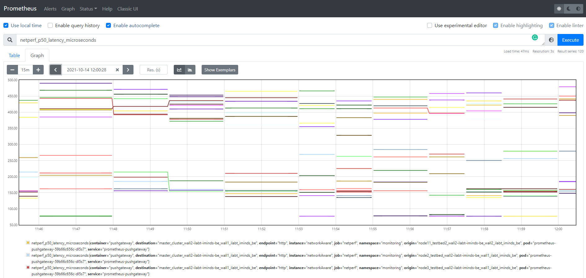
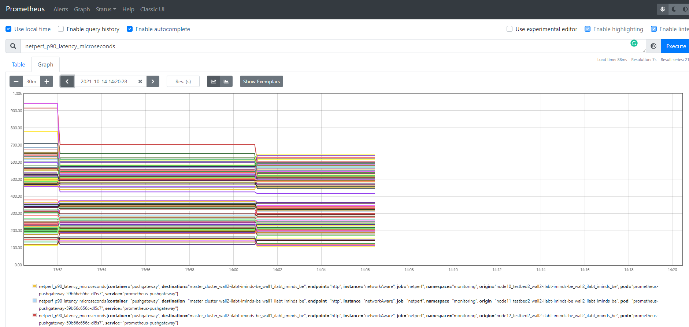
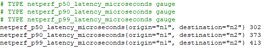
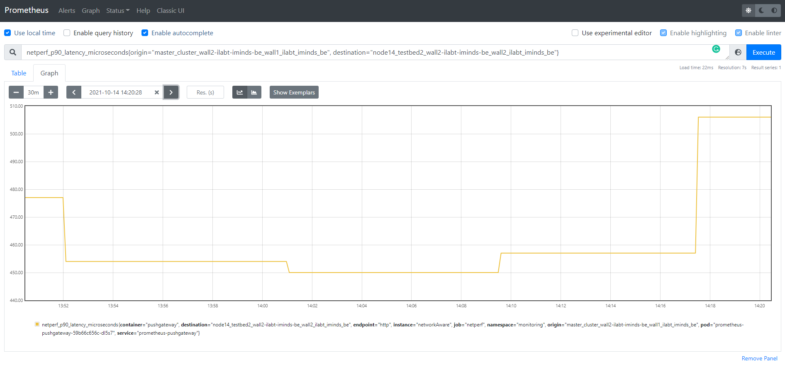

# pushing-netperf-metrics-to-prometheus

Repository for the netperf component used by the [Network-Aware framework](https://github.com/jpedro1992/scheduler-plugins/tree/kep-networkAware/kep/260-network-aware-scheduling) 
for the Kubernetes platform based the [Scheduler Framework](https://kubernetes.io/docs/concepts/scheduling-eviction/scheduling-framework/).

## Usage & Prerequisites

The goal is to perform netperf measurements between cluster nodes 
in Kubernetes and have the values available as metrics in [Prometheus](https://prometheus.io/) 
to make scheduling decisions based on latency.

First, Prometheus needs to be installed in the k8s-cluster. 
In our experiments, we have installed [kube-prometheus](https://github.com/prometheus-operator/kube-prometheus). 
Please follow their guidelines on how to properly set up kube-prometheus in your cluster. 

Then, we need to install the Prometheus [PushGateway](https://github.com/prometheus/pushgateway) 
since we are pushing the metrics to Prometheus via its PushGateway.  

To install the PushGateway alongside kube-prometheus, you can use [helm](https://helm.sh/) to deploy it in your cluster: 

```shell
helm install prometheus-pushgateway prometheus-community/prometheus-pushgateway --namespace monitoring --set serviceMonitor.enabled=true
```

You need to enable the service monitor to make sure kube-prometheus gets the data from the Pushgateway.

After installing kube-prometheus and the PushGateway, your monitoring namespace should look like this:

```shell
kubectl get pods -n monitoring

NAME                                      READY   STATUS    RESTARTS   AGE
alertmanager-main-0                       2/2     Running   0          43s
alertmanager-main-1                       2/2     Running   0          43s
alertmanager-main-2                       2/2     Running   0          43s
blackbox-exporter-6798fb5bb4-t6szj        3/3     Running   0          42s
grafana-7476b4c65b-k7lng                  1/1     Running   0          40s
kube-state-metrics-74964b6cd4-xgh8f       3/3     Running   0          39s
node-exporter-29gh8                       2/2     Running   0          37s
node-exporter-2pvnr                       2/2     Running   0          37s
node-exporter-bw87p                       2/2     Running   0          38s
node-exporter-dbfjq                       2/2     Running   0          38s
node-exporter-dk9hg                       2/2     Running   0          37s
node-exporter-fbhkg                       2/2     Running   0          37s
node-exporter-gblnq                       2/2     Running   0          37s
node-exporter-hhgl5                       2/2     Running   0          38s
node-exporter-njpp5                       2/2     Running   0          37s
node-exporter-nwrpb                       2/2     Running   0          37s
node-exporter-pkwgx                       2/2     Running   0          38s
node-exporter-szwpp                       2/2     Running   0          37s
node-exporter-w49j6                       2/2     Running   0          38s
node-exporter-z5ft9                       2/2     Running   0          38s
node-exporter-zqrx7                       2/2     Running   0          38s
prometheus-adapter-5b8db7955f-c7n99       1/1     Running   0          34s
prometheus-adapter-5b8db7955f-g2nkh       1/1     Running   0          34s
prometheus-k8s-0                          2/2     Running   0          32s
prometheus-k8s-1                          2/2     Running   0          32s
prometheus-operator-75d9b475d9-t4txw      2/2     Running   0          88s
prometheus-pushgateway-59b66c656c-nzlc6   1/1     Running   0          78s
```

Before running the netperf component, you should run the port-forward command to access the PushGateway via http://localhost:9090:

```shell
kubectl port-forward prometheus-pushgateway-59b66c656c-nzlc6 -n monitoring 9091
```

## Netperf Component

The netperf component is based on the k8s-netperf open-sourced [here](https://github.com/leannetworking/k8s-netperf)

First, you should run `kubectl apply -f k8s-netperf.yaml` to deploy the netperf pods as daemon sets. 
After deployment, the number of pods in the cluster depends on the number of nodes in your cluster: 

```shell
kubectl get pods -n default

NAME                           READY   STATUS    RESTARTS   AGE
netperf-host-2hngp             1/1     Running   0          15s
netperf-host-47jj6             1/1     Running   0          15s
netperf-host-4wbfq             1/1     Running   0          15s
netperf-host-7ltcw             1/1     Running   0          15s
netperf-host-9stmq             1/1     Running   0          15s
netperf-host-dfvmq             1/1     Running   0          15s
netperf-host-ftssm             1/1     Running   0          15s
netperf-host-hdzwq             1/1     Running   0          15s
netperf-host-hlvsh             1/1     Running   0          15s
netperf-host-jznvh             1/1     Running   0          15s
netperf-host-knnts             1/1     Running   0          15s
netperf-host-qfhms             1/1     Running   0          15s
netperf-host-qqhhg             1/1     Running   0          15s
netperf-host-srjz6             1/1     Running   0          15s
netperf-host-xj8lm             1/1     Running   0          16s
netperf-pod-2pk86              1/1     Running   0          16s
netperf-pod-77c9846498-gpfbv   1/1     Running   0          16s
netperf-pod-77c9846498-jrv7w   1/1     Running   0          16s
netperf-pod-8jhrg              1/1     Running   0          16s
netperf-pod-chlwx              1/1     Running   0          16s
netperf-pod-fhz9m              1/1     Running   0          16s
netperf-pod-gmhp2              1/1     Running   0          16s
netperf-pod-k6xfb              1/1     Running   0          16s
netperf-pod-mz6xh              1/1     Running   0          16s
netperf-pod-p6knm              1/1     Running   0          16s
netperf-pod-s29p4              1/1     Running   0          16s
netperf-pod-sd7k5              1/1     Running   0          16s
netperf-pod-tg5gw              1/1     Running   0          16s
netperf-pod-vbqj6              1/1     Running   0          16s
netperf-pod-w955l              1/1     Running   0          16s
netperf-pod-wt9cg              1/1     Running   0          16s
netperf-pod-z9r86              1/1     Running   0          16s
```

Then, you run our script `./runTest.sh` to:

- run the netperf measurements. 
- read the .csv and send the data to the Pushgateway. 
- repeat the loop, a timer can be set up (i.e., sleep)

The k8s-netperf perl script has been modified to run netperf tests between nodes and save the results in a .csv file. 
Two options exist: 

1) `runNetperf.pl`: It runs a test per node to another random node.  
2) `runNetperfV2.pl`: It runs a test for all nodes to every possible destination.

The first option is faster but not all data will be available at a given moment:

<p align="center"></p>

The second option takes longer but all data is available in Prometheus. 

<p align="center"></p>

The goal is to send to the Pushgateway the latency percentiles between nodes (i.e., 50th, 90th and 99th percentile latency in microseconds).

A python program `netperf_reporter.py` sends the data to the PushGateway based on the netperf reporter written for Cilium open-sourced [here](https://github.com/cilium/cilium/blob/master/contrib/scripts/netperf_reporter.py)

## Examples 

Example of a results.csv file:

```csv
origin,destination,netperf_p50_latency_microseconds,netperf_p90_latency_microseconds,netperf_p99_latency_microseconds
n5,n1,458,610,737
n4,n3,435,525,595
n3,n2,375,457,496
n2,n5,478,586,695
n1,n4,420,497,635
```

Metrics sent via the netperf reporter to the Prometheus PushGateway: 

<p align="center"></p>

Query example in Prometheus: 

<p align="center"></p>

## Contact

For questions or support, please use GitHub's issue system.